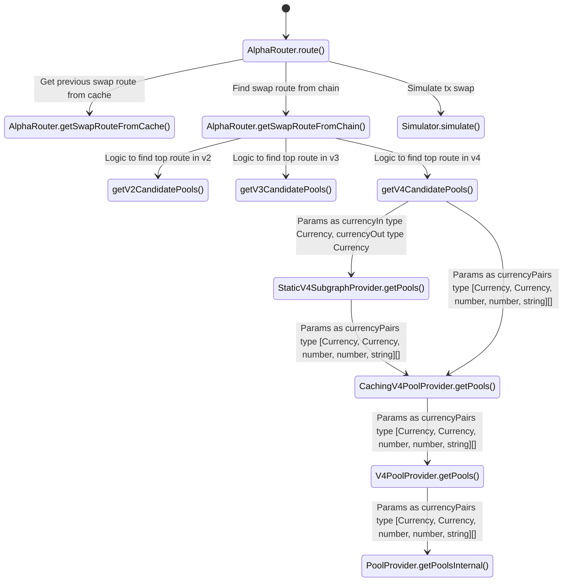

<h2>Alpha router</h2>
<table>
    <tr>
        <td width="20%">Name</td>
        <td width="10%">Type</td>
        <td width="70%">Path</td>
    </tr>
    <tr>
        <td>AlphaRouter</td>
        <td>Class</td>
        <td>src/routers/alpha-router/alpha-router.ts</td>
    </tr>
    <tr>
        <td>getV2CandidatePools getV3CandidatePools getV4CandidatePools</td>
        <td>Function</td>
        <td>src/routers/alpha-router/functions/get-candidate-pools.ts</td>
    </tr>
    <tr>
        <td>StaticV4SubgraphProvider</td>
        <td>Class</td>
        <td>src/providers/v4/static-subgraph-provider.ts</td>
    </tr>
    <tr>
        <td>CachingV4PoolProvider</td>
        <td>Class</td>
        <td>src/providers/v4/caching-pool-provider.ts</td>
    </tr>
    <tr>
        <td>V4PoolProvider</td>
        <td>Class</td>
        <td>src/providers/v4/pool-provider.ts</td>
    </tr>
    <tr>
        <td>PoolProvider</td>
        <td>Abstract Class</td>
        <td>src/providers/pool-provider.ts</td>
    </tr>
    <tr>
        <td>Simulator</td>
        <td>Class</td>
        <td>src/providers/simulation-provider.ts</td>
    </tr>
</table>

<h2>Config</h2>
<table>
    <tr>
        <td width="20%">Name</td>
        <td width="80%">Path</td>
    </tr>
    <tr>
        <td>Token Provider Address</td>
        <td>src/providers/token-provider.ts</td>
    </tr>
    <tr>
        <td>BASES_TO_CHECK_TRADES_AGAINST</td>
        <td>src/providers/caching-subgraph-provider.ts</td>
    </tr>
    <tr>
        <td>PROTOCOL_V4_QUOTER_ADDRESSES</td>
        <td>src/util/addresses.ts</td>
    </tr>
</table>
